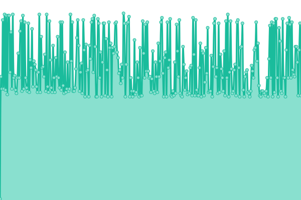

# [📈 Live Status](https://status.doebeling.de): <!--live status--> **🟨 Degraded performance**

This repository contains the open-source uptime monitor and status page for [Feiert.ag Eventkommunikation](https://www.feiert.ag), powered by [Upptime](https://github.com/upptime/upptime).

With [Upptime](https://upptime.js.org), you can get your own unlimited and free uptime monitor and status page, powered entirely by a GitHub repository. We use [Issues](https://github.com/Feiert-ag/status/issues) as incident reports, [Actions](https://github.com/Feiert-ag/status/actions) as uptime monitors, and [Pages](https://status.doebeling.de) for the status page.

<!--start: status pages-->
<!-- This summary is generated by Upptime (https://github.com/upptime/upptime) -->
<!-- Do not edit this manually, your changes will be overwritten -->
<!-- prettier-ignore -->
| URL | Status | History | Response Time | Uptime |
| --- | ------ | ------- | ------------- | ------ |
|  [Doebeling.de](https://Doebeling.de) | 🟩 Up | [doebeling-de.yml](https://github.com/DOEBELING/status.doebeling.de/commits/HEAD/history/doebeling-de.yml) | 

 196ms
     
 | 

<a href="https://status.doebeling.de/history/doebeling-de">100.00%</a>
    

|  [Andreas.Doebeling.de](https://Andreas.Doebeling.de) | 🟩 Up | [andreas-doebeling-de.yml](https://github.com/DOEBELING/status.doebeling.de/commits/HEAD/history/andreas-doebeling-de.yml) | 

 107ms
     
 | 

<a href="https://status.doebeling.de/history/andreas-doebeling-de">100.00%</a>
    

|  [Status.Doebeling.de](https://Status.Doebeling.de) | 🟩 Up | [status-doebeling-de.yml](https://github.com/DOEBELING/status.doebeling.de/commits/HEAD/history/status-doebeling-de.yml) | 

 292ms
     
 | 

<a href="https://status.doebeling.de/history/status-doebeling-de">100.00%</a>
    

|  [Perepelytsina.de](http://Perepelytsina.de) | 🟨 Degraded | [perepelytsina-de.yml](https://github.com/DOEBELING/status.doebeling.de/commits/HEAD/history/perepelytsina-de.yml) | 

 896ms
     
 | 

<a href="https://status.doebeling.de/history/perepelytsina-de">0.00%</a>
    

|  [Nadiia.Perepelytsina.de](http://Nadiia.Perepelytsina.de) | 🟨 Degraded | [nadiia-perepelytsina-de.yml](https://github.com/DOEBELING/status.doebeling.de/commits/HEAD/history/nadiia-perepelytsina-de.yml) | 

 736ms
     
 | 

<a href="https://status.doebeling.de/history/nadiia-perepelytsina-de">0.00%</a>
    

|  [Christian-Methfessel.de](https://christian-methfessel.de) | 🟩 Up | [christian-methfessel-de.yml](https://github.com/DOEBELING/status.doebeling.de/commits/HEAD/history/christian-methfessel-de.yml) | 

 603ms
     
 | 

<a href="https://status.doebeling.de/history/christian-methfessel-de">58.58%</a>
    

|  [Spruch-Archiv.com](https://Spruch-Archiv.com) | 🟩 Up | [spruch-archiv-com.yml](https://github.com/DOEBELING/status.doebeling.de/commits/HEAD/history/spruch-archiv-com.yml) | 

 1520ms
     
 | 

<a href="https://status.doebeling.de/history/spruch-archiv-com">61.81%</a>
    

|  [BlueBranch.de](https://www.bluebranch.de/) | 🟩 Up | [blue-branch-de.yml](https://github.com/DOEBELING/status.doebeling.de/commits/HEAD/history/blue-branch-de.yml) | 

 541ms
     
 | 

<a href="https://status.doebeling.de/history/blue-branch-de">60.98%</a>
    

<!--end: status pages-->

[**Visit our status website →**](https://status.doebeling.de)

## 📄 License

- Powered by: [Upptime](https://github.com/upptime/upptime)
- Code: [MIT](./LICENSE) © [Anand Chowdhary](https://anandchowdhary.com), supported by [Pabio](https://pabio.com)
- Data in the `./history` directory: [Open Database License](https://opendatacommons.org/licenses/odbl/1-0/)
